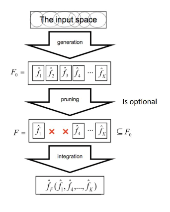
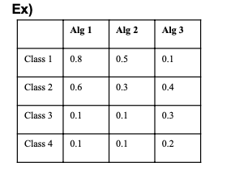
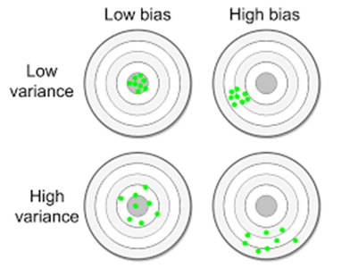
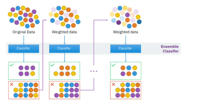

# 11. Ensemble Learning

Property 1: Bishop 14

# Ensemble Learning

지금까지 배운 여러개의 classifier 각각 : parameter 변화하여 여러가지 model

한 가지 model보다는 여러 model을 활용하여 prediction

## Introduction

model 여러개를 써서 여러개의 model을 조합하여 최종 model을 결정

- Ensemble learning is a process that uses a set of models, each of them obtained by applying a learning process to a given problem. This set of models (ensemble) is integrated in some way to obtain the final prediction
- Aggregation of multiple learned models with the goal of improving accuracy
    - 목표 : 정확도 높이기 / classification, regression acc, clustering acc에서 좋은 성능 얻기
    - Intuition: simulate what we do when we combine an expert panel in a human decision-making process
        - 사람들이 결정 내릴 때도 한 두명 생각보다는 전문 집단 panel에 의해서 결정 내리면 좀 더 합리적이고 좀 더 좋은 결정을 내릴거라 생각하는 것처럼 결정

## Types of ensembles

- fusion
    - 다른 version의 dataset, algorithm을 갖고 종합해 최종 판단
    - 두 개의 용어는 바슷한 개념으로 사용되고도 있고 엄밀하게 분류하기 애매함
- ensemble
    - randomness : 한 쪽은 NN, SVM <- 2 model, no randomness
    - NN 사용 시 w randomly init : w 초기값이 다른 model을 여러 가지 만들면 randomness로 model 만든 ensemble

→ randomness 추가된 부분 : ensemble / Randomness excluded : Fusion (섞어서 사용하기도 함)

---

- Ensemble methods are used for:
    - Classification
        - 각 model들이 분류 결과를 만들어나면 이를 조합하여 최종 (average)
        - classification alg 바꾸기 or dataset 변화를 주어 다른 모델 만들 수 있음
    - Regression
    - Clustering (also known as consensus clustering)
        - clustering : 여러 version의 clustering에서 average를 취하여 어떻게 avg할 것인가가 차이
            - group의 category로 분류 : label이 학습할 때 주어진게 아님
            → 1번 그룹 안 어떤 sample들이 동일한 그룹 안에 있다는 게 의미
            - 1번, 2번 group은 다른 group임이 의미
            -> clustering의 결과가 나타날 때 어떻게 합칠 것인가
- Ensembles can also be classifed as :
    - Homogeneous: It uses only one induction algorithm
        - 동일한 분류 algorithm의 경우에도 (induction algorithm = classifier)
            - Bayesian classifier에서도 pdf로 gaussian 사용 -> classifier의 구조를 바꾸면 다른 구조의 algorithm
            - 아예 다르게 바꾸게 되면 perceptron / svm/ decision tree 등 DNN/ CNN 자체도 구조는 차이가 있음
    - Heterogeneous: It uses different induction algorithms
        - algorithm의 구조에 차이가 있으면 heterogeneous

## Some Comments

- Combining models adds complexity
    
    
    - It is, in general, more difficult to characterize and explain predictions
        
        Model의 개수가 늘어나니까 전체 complexity 증가 → 설명하기도 어려워지고, 어떤 결과값이 나올지, 그 결과값 설명하기도 어려워짐
        
    - The accuracy may increase
        
        하지만 정확도는 일반적으로 향상됨
        
- Violation of Ockham’s Razor: **“Simplicity leads to better accuracy”**
    - simple decision boundary가 일반적으로 좋은 성능을 보인다
    - Identifying the best model requires identifying the proper “model complexity”
        - 좋은 성능을 내는 model을 찾으려면 complexity를 고민해야 하는데
        - occam에 거스르긴 하지만, 여러 model 사용하게 되면 개별 model은 복잡하지만 종합한 model은 smooth한 모양일수도 있음
        
        → simple하게 만드는 과정이라 볼 수 있고, occam’s razor에 적합
        
        - simple boundary = simple alg이라고 생각했는데, complexity를 올림으로 db가 simple해질수도 있다!
    - Decision boundary may become simpler, eventually. E

## The Ensemble Learning Process

data가 주어지면 그에 대해 함수들을 생성 - 각각이 분류 함수들 k개의 model 생성→ pruning

→ 최종 함수 fk 도출

# Methods to Generate Ensembles

- Data Manipulation
    
    1. Train set에 변화
    
    Supervised learning에서 train set에 대해 train 되어 얻어진 model
    
    - 다른 train set을 사용하면 -> 다른 model : 분류 성능이 다름
    - it changes the training set in order to obtain different models
- Modeling process manipulation
    
    2. algorihtm에 변화
    
    - model process manipulation : algorithm의 변화
    - parameter만 변화하는 경우도 있고, classifier 자체를 변경할수도 있음, algorithm 자체를 변화시킬수도 있고
    - → 다양한 model (f1 _ /// fk)
    - it changes the induction algorithm, the parameter set or the model in order to obtain different models

## Data manipulation

Data, algorithm에 대한 구분

- data : data의 src로부터 subset 추출

Data src / sensor (visible, thermal, near infrared)

빛의 파장이 가시광선, 적외선 등에 따라 영상이 다양히 나타나는데 개별적인 src로 판단할 수 있고 이를 조합하는 것 또한 ensemble이라 볼 수 있다

- 그런 식의 ensemble을 Fusion이라고 볼 수도 있다.

- Manipulating the input features
    
    
    
    movie data features : rating, actor, genre
    -> 흥행할것인지, 수익이 어느정도일 것인지, 그룹의 사람들이 좋아할지
    
    - 세 feature를 다르게 조합하여 각각의 경우가 모두 다른 classifier model
- Sub-sampling from the training set
    
    
    
    data의 분할 : subset들 조합하여 최종 결과
    

## Modeling process manipulation

- Manipulating the parameter sets
    - hyperparameter : network layer, 초기값을 어떻게 설정할지,
    node 개수, activation fn은 어떻게 설정할지
    
    
    
- Manipulating the induction algorithm
    
    
    

## How to Combine Models

- Algebraic methods : Score를 어떻게 처리할 것인가
    - Average
    - Weighted average
    - Sum
    - Weighted sum
    - Product
    - Maximum
    - Minimum
    - Median
- Voting methods
    - Majority voting
    - Weighted majority voting
    - Borda count

# Characteristics of the Base Models

- The Base classifiers should be as accurate as possible and having diverse errors, while each classifier provides some positive evidences
    - diverse한 error가 나타나야 함. (Alg1, alg2 … 결과가 diverse)
    - 어느 정도의 정확도를 가지면서 정답의 다양성을 가져야 classify의 의미가 있다
    - 여러 version의 classifier를 ensemble하여 좋은 classifier
- The average error of the base learners should be as small as possible
- The variance (of the predicted values) of the base learners should be as small as possible
    - Variance : when alg1 is trained
    
    Random한 initial value에 의하여 train 여러번하는데
    
    Variance 정확도가 많이 변화한다면 좋은 classifier가 아닐 것
    
    diversity
    
    Stability : 한 알고리즘을 볼 때 다양하지 않은 결과
    
    bias : ansewr과의 차이
    
    Variance : 얼마나 정답이 다양하겠는가
    

## Popular Ensemble Methods

Bagging:

- Averaging the prediction over a collection of predictors generated from **bootstrap samples** (both classification and regression)
    
    bootstrap sample :trian data있으면 subset sampling
    
    - 각각 sampling으로부터 classifier 학습
        
        Random하게 sampling하며 다양한 model
        

Boosting:

- Weighted vote with a collection of classifiers that were trained sequentially from training sets given priority to instances **wrongly classified**
    
    Boosting : 여러 단계를 거쳐 classifier 학습
    
    - 이전 단계의 classifier의 오답에 초점을 맞춘다.
    
    오류가 나오는 data들을 모아 다음 stage에서 초점을 맞추어 학습하여 융합한다
    

RandomForest:

- Averaging the prediction over a collection of trees constructed using a **randomly selected subset of features**
    - tree를 randomly생성하여 randomly select해서 만든다.

Ensemble learning via negative correlation learning:

- Generating sequentially new predictors **negatively correlated** with the existing ones
    - 현재 classifier하고 negative corelation갖는 classifier를 학습하여 융합한다

Heterogeneousensembles:

- Combining a set of **heterogeneous predictors**
    - NN + SVM + DT 등 융합

# Bagging: Bootstrap AGGregatING

- Analogy: Diagnosis based on multiple doctors’ majority vote
    
    여러 명의 의사들의 진단 결과를 융합하는 방법
    
    Ex. Max score, average score 등
    
    - 여러 model을 만들기 위해서 bootstrap sampling

- Training
    - Given a set D of d tuples, at each iteration i, a training set $D_i$ of $d$ tuples is sampled with replacement from D (i.e. bootstrap)
        - bootstrap 방법 : sampling with replacement - 전체 dataset으로부터 sampling하여 modeling하고 다시 복원
        - 각각의 data subset에 대하여 model을 만듬

average, Sum 은 같은 방식 : sum에서 classifier number만큼 나눠주면 average value

- bootstrapping = original data로부터 sampling
- aggregating = 그것들로부터 각각의 classifier를 만들어 병합하는 방법
- Classification: classify an unknown sample X
    - Each classifier $M_i$ returns its class prediction
    - The bagged classifier $M^*$ counts the votes and assigns the class with the most votes to X
        - 각 classifier가 sample에 대한 class 예측값을 계산하고, 그리고 최종 판단은 voting / sum/ 등 여러 방법을 사용할 수 있다.
- Prediction:
    - can be applied to the prediction of continuous values by taking the average value of each prediction for a given test tuple
    

- Accuracy
    - Often significantly better than a single classifier derived from
        
        significantly better : 5 ~ 10% 상승
        
        - 물론 model을 여러번 쓰고 연산량은 그만큼 증가
        - test stage : Test sample에서는 model들 다 유지해서 그만큼 분류 작업 수행 후 융합
        
        Train + test stage 연산량 증가
        
    - For noisy data: not considerably worse, more robust
        - noisy data : robust하게 됨 (boost sampling : Noisy data가 빠진 형태로 학습)
    - Proved improved accuracy in prediction
- Requirement: need unstable classifier types
    - Unstablemeansasmallchangetothetrainingdatamayleadtomajor decision changes
    - requirement : unstable classifier
    
    Unstable : train data를 조금 바꿀 경우 model decision이 크게 바뀌는 model을 의미함
    
    (Remind) Model이 바뀐 train data에 대해서 diverse한 error = variance가 커야 한다.
    
    - bagging의 관점에서는 var 큰게 좋다 (일반적으로는 별로 안 좋다)

- Stability in Training
    - Training: construct classifier from
    - Stability: small changes on results in small changes on
        
        Training : f를 d로부터 형성
        
    - Decision trees are a typical unstable classifier

# Boosting

- Analogy: Consult several doctors, when there are disagreements, we focus more attention on that case
    
    의사들의 의견이 갈릴 때 합치되지 않는 의견들에 대해 더 주의를 기울인다.
    

- Incrementally create models selectively using training examples based on some distribution.
    - Incrementally하게 sample이 subset으로 selection된 확률값을 가지고 있음
- How boosting works?
    - Weights are assigned to each training example
    - A series of k classifiers is iteratively learned
    - After a classifier $M_i$  is learned, the weights are updated to allow the subsequent classifier, $M_i +1$, to pay more attention to the training examples that were misclassified by
    - The final $M^*$ combines the votes of each individual classifier, where the weight of each classifier's vote is a function of its accuracy 𝒊
- 각 sample들이 weight를 가지고 있음.

그리고 우리는 k개의 classifier를 학습할 것

그런데 M_i가 학습 된 다음, classifier가 학습된 이후에는

weight을 update하는데 앞 단계에서 학습된 model들이 misclassified 에 더 주의를 기울인다 (weight를 올린다)

- > higher chance to be selected

즉 misclassified sample들이 점점 그 쪽으로 select되면서 hard sample들이 점점 추가되어 뒤쪽 classifier 학습

1~k개 classifier를 조합하여 m*

- weighted combination : weight는 accuracy에 비례
- boosting 기본 아이디어 : disagreement, hard sample

Hard sample에 초점 맞추는 방법 : classifier 1번을 만들고 misclassified에 대해서 classifier 2번을 만들고 m1, m2가 다른 결정을 내리는 sample에 대해서 classifier 3번을 만들어 test sample이 들어오면 m1, m2를 돌려 최종 결과로 사용하고 두 분류기 결과가 다르면 m3를 활용하여 결과 도출

(data가 다시 sampling될 확률값 조정하는 방식 : adaboosting)

- M_i : weak classifier

## Adaboost

- Using Different Data Distribution
    - Start with uniform weighting
    - misclassified sample의 weight 증가
    - well classified sample에 대해서는 weight 감소
    - During each step of learning
        - Increase weights of the examples which are not correctly learned by the weak learner
        - Decrease weights of the examples which are correctly learned by the weak learner
- Idea
    - Focus on difficult examples which are not correctly classified in the previous steps
    - difficult example에 더 주의를 기울인 케이스

- Weighted Voting
    - Construct strong classifier by weighted voting of the weak classifiers
    - 
    - strong classifier 만들 때 weak classifier 에 weight를 주고 weighted voting / weighted sum 등 일반적인 ensemble 방법 적용
    - weak classifier를 많이 첨가하여 combined classifier의 accuracy 증가 (strong classifier/learner)
- Idea
    - Better weak classifier gets a larger weight
    - Iteratively add weak classifiers
        - Increase accuracy of the combined classifier through minimization of a cost function Ensemble Learning Adaboost Introduction to Machine Learning Page 17

- Differences with Bagging:bagging과의 차이점
    - Models are built sequentially on modified versions of the data
        - random하게 sample된게 아니라 weight에 의해 sample된 data에 의해 학습
    
    - The predictions of the models are combined through a weighted sum/vote
        - 점점 hard sample에 대해 학습되니 easy sample / hard sample의 classifier가 동일한 weight를 가질 수 없음 : bagging은 동일한 조건으로 randomly sampling (no weight)
            - 거의 동등한 조건이기 때문에 weight를 주지 않음
            - boosting의 경우 misclassified에 대해 overfitting (hard sample이 증가하는 방향으로 weight update)-> ensemble하면 점점 hard sample 추가되며 overfitting 위험
- Boosting algorithm can be extended for numeric prediction
    - Comparing with bagging: Boosting tends to achieve greater accuracy, but it also risks overfitting the model to misclassified data
    
- The diagram should be interpreted with the understanding that the algorithm is sequential: classifier $C_k$ is created before classifier $C_{k+1}$, which in turn requires that $\beta_k$ and the current distribution $D_k$ be available
    
    
    
    - sequential = 앞서 misclassified sample을 구해야 이를 바탕으로 추가 학습을 진행하기에
    ck는 ck+1보다 학습이 사전에 이루어져야 하며
    Beta k : 4th classifer의 error / 현재 data distribution을 알아야 다음 단계 classifer를 학습시킬 수 있음

### Comments

이런식으로 sample distribution에 의해 data update하여 학습하면
앞 쪽 단계 misclassified data들이 current stage에 학습

- hard sample에 편중하여 학습이 일어남 (undemocratic voting scheme)
Weighted majority voting : ensemble 대상 단위의 classifier들이 성능 상 큰 차이 존재가 있어 weight를 줄 수밖에 없고 성능 좋은 classifier에 대해 더 높은 weight를 주는 게 더 자연스러울 수 있고, 이런게 democratic하지는 않다.
- This distribution update ensures that instances misclassified bythe previous classifier are more likely to be included in the training data of the next classifier.
- Hence, consecutive classifiers’ training data are geared towards increasingly hard-to-classify instances.
- Unlike Bagging, AdaBoost uses a rather undemocratic voting scheme, called the weighted majority voting.
    - The idea is an intuitive one: those classifiers that have shown good performance during training are rewarded with higher voting weights than the others.

## 

# Random Forest

- Random Forest: A variation of the bagging algorithm - bagging처럼 여러 개 ensemble
- Created from individual decision trees
    - Diversity is guaranteed by selecting randomly at each split, a subset of the original features during the process of tree generation
    - **tree 구조 : unstable 구조 → diversity가 guaranteed됨 automatically**
- R.F 활용
    - During classification, each tree votes and the most popular class is returned
        - classification에서는 : vote를 가장 많이 받은 class가 최종 결과 decision
    - During regression, the result is the averaged prediction of all generated trees
        - regression에서는 :각 tree들이 result을 만드는데 이를 average 취하면 random forest result
- random selection이 : feature selection / data sampling

- Two Methods to construct RandomForest:
    
    Random forest 만드는 두 가지 방법
    
    1. Random input selection : 각 node에서 attribute를 randomly selection하는 방법
        - Forest-RI (random input selection): Randomly select, at each node, F attributes as candidates for the split at the node. The CART methodology is used to grow the trees to maximum size
    2. Random linear combination: 기존 feature에 대한 linear combination 작업을 취하여 여러 개의 attribute에 linear combination을 바탕으로 tree 학습을 진행한다.
        - Forest-RC (random linear combinations): Creates new attributes (or features) that are a linear combination of the existing attributes (reduces the correlation between individual classifiers)

- adaboost와 유사한 특징을 가지지만 error / outlier에 더 robust한 특성을 보인다.
    - Comparable in accuracy to Adaboost, but more robust to errors and outliers

- 민감하게 반응하지는 않고 더 빠르게 실행 : decision tree 생성 과정은 학습 model 자체가 효율적으로 구성될 수 있기 때문에 (tree 구성)
    - Insensitive to the number of attributes selected for consideration at each split, and faster than bagging or boosting

# Model Selection

- Given a problem, which algorithms should we use?

- Golden rule: there is no algorithm that is the best one for all the problems
    - 하나의 특정 알고리즘이 다른 모든 problem 모두를 해결하지는 않는다
- Typically, two approaches (or both) can be adopted:
    - To choose the algorithm more suitable for the given problem
    - To adapt the given data for the intended algorithm (using pre-processing, for instance)
        - 주어진 data를 잘 tuning할 수 있도록 한다 for 사용하고자 하는 algorithm (preprocessing)
- The concept of “good algorithm” depends on the problem:
    - good algorithm : prob by prob
    - Explainability : model이 어떤 판단을 내린다면 판단의 정확도도 중요하나 그 결정의 이유도 중요함 : bayesian, decision tree는 쉽게 설명할 수 있는데 그 외에는 설명이 쉽지 않음
    - 분류 관리 문제에 있어서는 이송 시간 예측 정확도가 가장 중요한 선택요인
    - For a doctor, the interpretation of the model can be a major criterion for the selection of the model (decision trees and Bayesian networks are very appreciated)
    - For logistics, the accuracy of travel time prediction is, typically, the most important selection criterion.

# Statistical Validation

- Mixture of Experts
    - Combine votes or scores
    
    
    
- Stacking
    - Combiner f() is another learner (Wolpert, 1992)
    - adaboost도 최종 함수 : 개별 classifier에 근거하여 accuracy로부터 sequentially 생성
        
        Stacked generalization by [David H.Wolpert](https://www.sciencedirect.com/science/article/abs/pii/S0893608005800231#!)
        
        [https://www.sciencedirect.com/science/article/abs/pii/S0893608005800231](https://www.sciencedirect.com/science/article/abs/pii/S0893608005800231)
        
    
    
    
- Cascading
    - Use next level of classifier if the previous decision is not confident enough
    
    