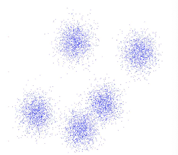
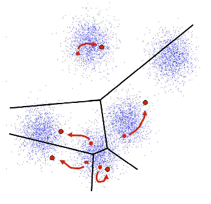
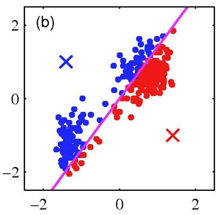
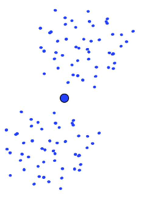
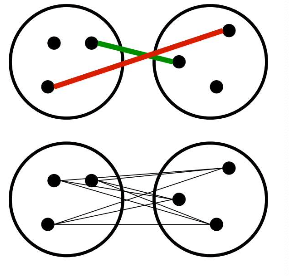
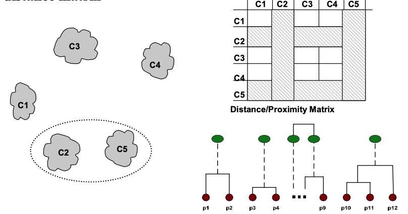
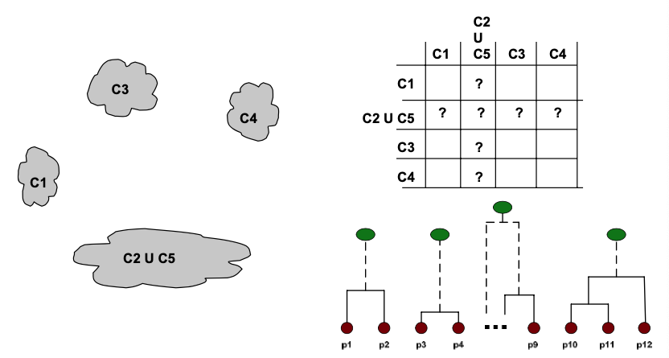
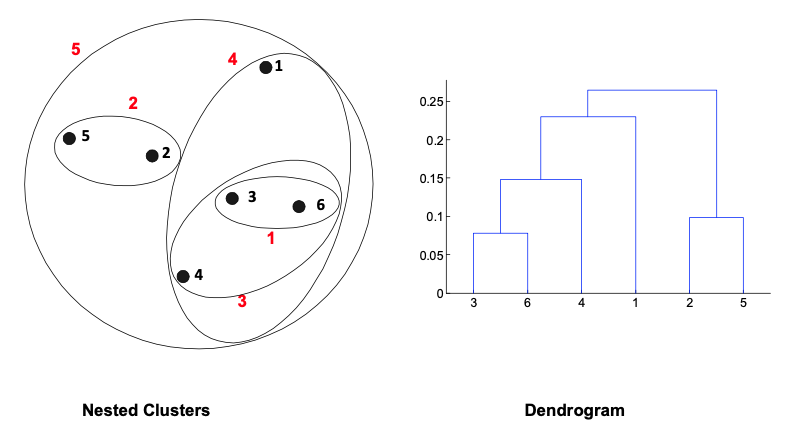

# 12. Clustering

# Clustering

- Unsupervised learning
- Requires data, but no labels
    - label이 없다
- Detect patterns e.g. in
    - data pattern을 인식하려고 한다 : email / 검색 결과 / 쇼핑 패턴 / 이미지 리전으로부터
- Useful when don’t know what you’re looking for Clustering
    - 일단 clustering 수행하고 나면 해당 data가 어떻게 이루어지는지는 알 수 있다

- Basic idea: group together similar instances
- Example: 2D point patterns Clustering

- What could “similar” mean?
    - One option: small Euclidean distance
        
        ‘ similarity’를 어떻게 판단할 수 있는가
        
        - 2 dim 공간 상 거리 -> Euclidean distance
        Similarity 는 distance에 반비례
    - Clustering results are crucially dependent on the measure of similarity (or distance) between “points” to be clustered

- Partition algorithms
    - K-means
    - Mixture of Gaussian
    - Spectral clustering
- Hierarchical algorithms
    - Bottom up : agglomerative
    - Top down : divisive

## Clustering Examples

- Image segmentation
    - Image segmentation : 인접한 유사한 feature를 가진 pixel 끼리 group으로 분할
    - Goal: Break up the image into meaningful or perceptually similar regions
    
    
    
- Clustering gene data
    
    Hierarchical clustering : gene group에 큰 두 개의 gruop이 있음을 판단할 수 있다.
    
    - 나중에 들어오는 data에 대해서도 두 가지 class 대상으로 labeling할 수도 있고 두 가지 label로 supervised learning도 가능
    
    
    
- Cluster news articles
    
    
    
- Cluster people by space and time
    
    
    
- Cluster languages
    
    
    
    
    
- Cluster species (phylogeny)
    
    
    
- Cluster search queries
    
    
    

# K-Means Clustering

An iterative clustering algorithm

- Initialize: Pick K random points as cluster centers
    
    0. cluster의 개수 가정 : k개의 cluster = k개의 random point 초깃값 assume
    
- Alternate:
    1. Assign data points to closest cluster center
        
        1. k개의 pt에 대해서 각각의 data들을 가장 가까운 cluster center에 할당하고
        
    2. Change the cluster center to the average of its assigned points
        
        2. Cluster center update : 각 iteration마다 update
        
        - 더 이상 update되지 않는 시점에서 cluster 중단
- Stop when no point assignments change
    
    초깃값에 대해서 (initial center point) partition 나눔
    
    - 그 data들의 center mean을 구해서 이로 center를 update함
    - 이를 기반으로 update된 값들의 member들을 재할당
    - 반복하다 보면 각각의 cluster의 center로 이동하게 됨

## K-Means Clustering: Example

- Pick K random points as cluster centers (means)
- Shown here for K=2

### Iterative Step 1

- Assign data points to closest cluster center
    - mean값에 대해서 다시 partition./ center값 할당하며 반복하게 되면
    K means clustering 작업에 의한 clustering 결과를 얻게 됨.

### Iterative Step 2

- Change the cluster center to the average of the assigned points

## Properties of K-means algorithm

- Guaranteed to converge in a finite number of iterations
    
    k값이 대략적인 cluster개수와 일치해야지, 그렇지 않으면 만족하지 못할 결과가 나올 수도 있음
    
- Running time per iteration:
    1. Assign data points to closest cluster center : O(KN)
        
        k개의 point, n samples -> kn
        
    2. Change the cluster center to the average of its assigned points : O(N) 
        
        Cluster center average -> n
        

## Properties of K-means algorithm (convergence)

- Objective
    
    모든 sample들에 대해서 center값을 계산 :sample들의 center 값으로부터의 거리 제곱의 합이
    k개의 cluster에 대해서 최소
    
    - cluster center에 잘 일치하게 되면, 해당 cluster에 속하는 sample들이 그 cluster center 와 이루는 거리의 합이 모든 cluster에 대해서 minimum이 됨
    
    $$
    \min_{\mu} \min_{c}  \Sigma_{i=1}^{k} {\Sigma_{x\in C_i}|x-\mu_i|^2}
    $$
    
- Fix $\mu$, optimize $C$
    
    iteration작업- partition update
    
    - mu 고정, C optimize
    - center까지의 모든 sample들의 거리를 최소화하는 작업
    
    $$
    \min_{c}  \Sigma_{i=1}^{k} {\Sigma_{x\in C_i}|x-\mu_i|^2} = \min_{c}  \Sigma_{i=1}^{n} {|x_i-\mu_{xi}|^2} 
    $$
    
- Fix $\mu$, optimize $\mu$
    
    Partition update후 center값 update
    
    - 각 cluster sample들에서 sample들로부터 center 거리를 최소화시킬 수 있도록 평균값 설정
    - mu에 대해서 미분하고ㅡ 이를 0으로 setting하면 평균값이라는 것은 각 cluster에 속한 sample들의 값의 합을 그 cluster에 속한 sample들의 값의 합을 그 cluster에 속한 sample들의 개수로 나눈 값이 그 center 값 : center mean
    
    $$
    \min_{\mu} \Sigma_{i=1}^{k} {\Sigma_{x\in C_i}|x-\mu_i|^2}
    $$
    
    - Take partial derivative with respect to $\mu_i$and sets to zero, we have $\mu_i = \frac 1 {C_i} \Sigma_{x\in C_i} x$
- K-means takes an alternating optimization, each step is guaranteed to decrease the objective – thus guaranteed to converge

## Example: K-Means for Image Segmentation

- Goal of image segmentation is to partition an image into regions each of which has reasonably homogenous visual appearance.
    
    K means clustering segmentation
    
    - clustering : space상에서 한 게 아니고 color값들이 r,g,b의 값을 갖는데 256^3 의 dimension 3 histogram
    - k개의 color로 clustering

# K-means algorithm - initialization

K-means algorithm is a heuristic

- converging하기도 하고 완전 heuristic하지는 않고 완전 이상한 initial value로 하면 아예 못 구하기도 함
- Requires initial means
    - 초기 center값에 따라 최종 결과가 잘못될수도 있음
    - It does matter what you pick!
- What can go wrong?
- Various schemes for preventing this kind of thing: variance-based split / merge, initialization heuristics

- A local optimum
    
    
    
- Would be better to have one cluster here
    
    
    

# K-means algorithm

- Not able to cluster properly

- Changing the features (distance function) can help

# Clustering Hierarchical Clustering

Two main types of hierarchical clustering

- Agglomerative: 각각의 개별 sample로 시작해서 cluster로 간주하여 각각을 merge하여 최종적으로 1~k개의 cluster가 되기까지 merge
    - Start with the points as individual clusters
    - At each step, merge the closest pair of clusters until only one cluster (or k clusters) left
- Divisive:하나에서 개별 cluster로 divide
    - Start with one, all-inclusive cluster
    - At each step, split a cluster until each cluster contains a point (or there are k clusters)
- Traditional hierarchical algorithms use a similarity or distance matrix
    
    similarity와 distance는 서로 역수 관계
    
    - Merge or split one cluster at a time
        
        Merge/split하는 방식을 hierarchical clustering이라고 함
        

# Agglomerative clustering

- supervised : data label 제공 / unsupervised : data label 미제공
    - → labeling해서 classification, regression 수행
- clustering : hierarchical process로 data 분석하기도 하고

이상 전기 신호를 어떻게 구분할 것인가 (classification) 해야 하는데 이에 대한 label이 없음

몇 년치 data를 labeling하기도, 분석도 바로 못 들어감.

→ 평균치보다 크거나 작은 값을 군집화하여 이상신호를 보고 판단하고 labeling 수작업

정상과 비정상의 label에 대하여 이후 들어오는 data들에 대하여 수작업 (supervised)

- Agglomerative clustering
    - First merge very similar instances
        - 비슷한 data끼리 grouping : 처음에는 모든 data pt가 개별 cluster로 되고 점차 하나의 group이 될 때까지 group화
    - Incrementally build larger clusters out of smaller clusters
        - 가장 similarity가 큰 data끼리 group화함 :
            - 1,3을 하나의 group으로 묶고 2, 5 group으로 묶이게 되면 1st-2nd group간 거리는 가장 가까운 거리로 할 것인지 (1-2) 먼 거리로 할 것인지 (3-5) 평균으로 할 것인지에 따라, similarity 판단 기준에 따라 clustering이 다르게 됨
- Algorithm:
    - Maintain a set of clusters, Initially, each instance in its own cluster
    - Repeat:
        - Pick the two closest clusters
        - Merge them into a new cluster
        - Stop when there’s only one cluster left
- Produces not one cluster, but a family of clusters represented by a dendrogram

- How should we define “close” for clusters with multiple elements?
    - similarity를 어떻게 판단할 것인가  =(distance를 어떻게 계산할 것인가)
    - closest / Farthest / Average → cluster가 달라지게 됨
        
        
        
- Many options:
    - Closest pair (single-link clustering)
    - Farthest pair (complete-link clustering)
    - Average of all pairs
- Different choices create different clustering behaviors

## Strengths of Hierarchical Clustering

- No assumptions on the number of clusters
    - cluster 개수 가정하고 수행하게 됨
    - 단) cluster 개수 잘못 예측하면 algorithm 좋지 않은 결과를 낼 것
    - Any desired number of clusters can be obtained by ‘cutting’ the dendogram at the proper level
- Hierarchical clusterings may correspond to meaningful taxonomies
    - cluster 몇 개인지 모르는 상태에서 clustering
    - clustering : dendrogram 그려서 duration 긴 구간을 판단하여 cluster 개수 결정 / 적절한 상태에서 dendrogram cutting
    - 대칭적 분류 : phylogeny. Catalog
    - Example in biological sciences (e.g., phylogeny reconstruction, etc), web (e.g., product catalogs), etc.

## Complexity of hierarchical clustering

- Distance matrix is used for deciding which clusters to merge/split
    - distance <-> proximity
- data point n개가 있다면, n by n개 distance를 모두 계산함 : n^2 연산
    - At least quadratic in the number of data points
        - Not usable for large datasets

group화가 진행되며 Matrix 크기가 점차 줄어들게 되어 최종적으로 하나의 block만 남게 됨

# Agglomerative clustering algorithm

Data point distance metric계산하고 각각의 data point가 개별 cluster로 여겨지고 Closest cluster끼리 merge되고 (방법에는 최단/최대/평균)

Compute the distance matrix between the input data points Let each data point be a cluster Repeat Merge the two closest clusters Update the distance matrix Until only a single cluster remains

- Key operation is the computation of the distance between two clusters
- Different definitions of the distance between clusters lead to different algorithms Clustering
- Most popular hierarchical clustering technique
- Basic algorithm

## Input/ Initial setting

n Start with clusters of individual points and a distance/proximity matrix 

## Intermediate State

- After some merging steps, we have some clusters
    - 
    - clustering이 진행되면 group화 진행
    - 처음에 data point 12개여서 12*12
    -> clustering되어 5*5
    - data dimension이 커지면 거리 계산에 어려움
    - dimension별 scaling : K nearest neighbor에서 고려해야 함

- Merge the two closest clusters (C2 and C5) and update the distance matrix
    
    
    
- How do we update the distance matrix?
    
    
    

# Distance between two clusters

- Each cluster is a set of points
- How do we define distance between two sets of points
- Lots of alternatives
- Not an easy task

- Single-link distance between clusters Ci and Cj is the minimum distance between any object in Ci and any object in Cj
    - Single link : shortest distance
- The distance is defined by the two most similar objects
    
    $$
    D _{s l} ( C _i , C _j ) = \min _{x , y} (d ( x , y )| x \in C _i , y \in C _j ) 
    $$
    

# Single-link clustering: example

- Determined by one pair of points, i.e., by one link in the proximity graph
    
    Diagonal value를 보고 판단할 수 있음
    
    같은 요소에 대한 값이 1-> similarity
    
    - data 분포에 의하면 1,2,3,4,5 clustering
    - symmetric : 대각선 아래 부분은 크게 의미가 없음
    - 값이 높은 순대로 먼저 cluster를 형성하게 됨

- Can handle non-elliptical shapes
    
    
    

- Sensitive to noise and outliers
- It produces long, elongated clusters

## Distance between two clusters

- Complete-link distance between clusters Ci and Cj is the maximum distance between any object in Ci and any object in Cj
- The distance is defined by the two most dissimilar objects
    
    가장 먼 거리의 simple pair에 대해서 data를 clustering (Most dissimilar)
    
    Most similar
    

$$
D _{s l} ( C _i , C _j ) = \max _{x , y} (d ( x , y )| x \in C _i , y \in C _j ) 
$$

## Complete-link clustering: example

- Distance between clusters is determined by the two most distant points in the different clusters
    
    거리 판단한 이후(차이-dissimilar)
    cluster끼리 병합할 때는 가장 가까운 것 끼리 (동일)
    

- More balanced clusters (with equal diameter)
    
    Balance : separation이 조금 더 명확해졌고 cluster의 크기가 비슷하게 분류됐고, noise에 대해서 약간 덜 예민해짐
    
- Less susceptible to noise

- Tends to break large clusters
- All clusters tend to have the same diameter – small clusters are merged with larger ones
    
    큰 cluster를 작게 쪼개려고 하는 성질
    
    - cluster크기가 커지면 다른 sample들과 계산하건 거리가 크게 나옴 : 큰 덩어리가 분할되는 결과를 가져옴
    - 전체 cluster들이 비슷한 결과
    - 작은 cluster들이 큰 것을 흡수

# Distance between two clusters

- Group average distance between clusters Ci and Cj is the average distance between any object in Ci and any object in Cj
    - 전체 data pair의 average 이용
    - I cluster , j cluster : 평균 distance 계산한 후 shortest path 결정

$$
D_{avg} (C_i, C_j) = \frac 1 {|C_i| \times |C_j| } \Sigma_{x\in C_i, y \in C_j} d(x,y)
$$

# Average-link clustering: example

- Proximity of two clusters is the average of pairwise proximity between points in the two clusters.

Average distance의 길이가 짧을수록 stable cluster

# Average-link clustering: discussion

- Compromise between Single and Complete Link
- Strengths
    - Less susceptible to noise and outliers
- Limitations
    - Biased towards globular clusters 각각의 cluster를 구 형태로 만드려는 특성

# Hierarchical Clustering: Comparison

- 최종 cluster는 동일
- 중간 cluster에서는 계산 방식이 다르기 때문에 다른 형태

# Divisive hierarchical clustering

Top-down : global (optimal)

- 한 번에 하나의 cluster를 split : which to divide
- calculation 많아짐

Bottom-up : local (heuristic, greedy)

- 개별 data를 각각의 cluster -> 점차 Merge하며 하나의cluster
- 

Divisive top down

- detailed cluster로 split recursively
- 사용할 dimension, variable의 개수 정도

monotheistic : 한 번에 한 개

polytheistic : 여러 dim/var을 한 번에

(Univariate / multivariate)

- distance measure metric : 수치 등의 기준

1 : n-1 (n)/ 2: n-2 (nC2)/ … 경우의 수를 따져볼 수 있고 최종적으로 하나의 Cluster

- 가장 적합한 split을 선택
- 모든 경우의수 따져보면 bottom up보다 더 많이 연산을 요구할 것인지는 차이가 있을 수 있음
- 일반적으로 agglomerative bottom-up방식 사용 : dendrogram방식으로 다양한 단계에서의 Clustering을 수행하며 정보를 얻고 취합하여 최종 Cluster 결과 선정 가능
- 현재 상태의 cluster에서 가장 가짜운 Cluster과 Merge : optimal보다는 heuristic, Greedy (전체 objective를 최적화하는 global의 개념은 아님-너무 연산 많아짐)

- Start with a single cluster composed of all data points
- Split this into components
- Continue recursively
- Monothetic divisive methods split clusters using one variable/dimension at a time
- Polythetic divisive methods make splits on the basis of all variables together
- Any intercluster distance measure can be used
- Computationally intensive, less widely used than agglomerative methods

- Initially, all points in the dataset belong to one single cluster
- Partition the cluster into two least similar cluster
- Proceed recursively to form new clusters until the desired number of clusters is obtained Clustering Divisive hierarchical 53

- Check the sum of squared errors of each cluster and choose the one with the largest value.
- In the dataset below, the data points are separated into 2 clusters
- For further separating it to form the 3rd cluster, find the sum of squared errors (SSE) for each cluster
- The cluster with the largest SSE value is separated into 2 clusters