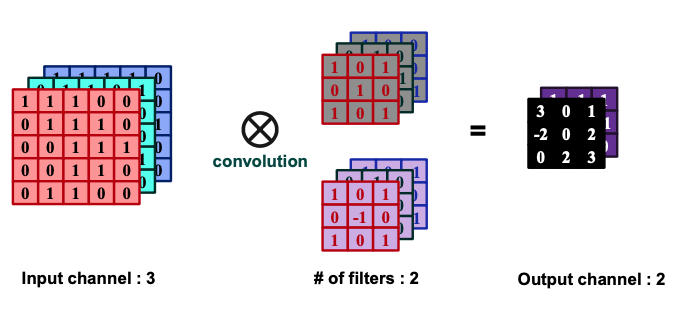
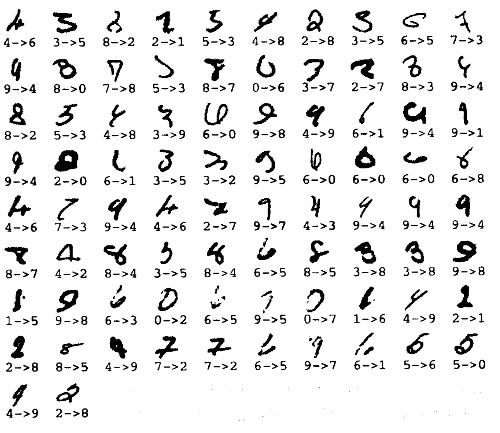
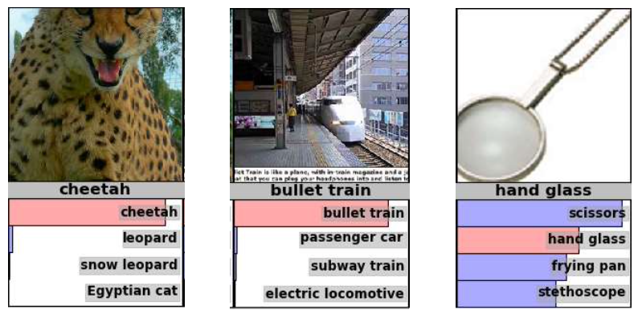
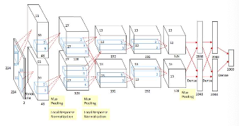
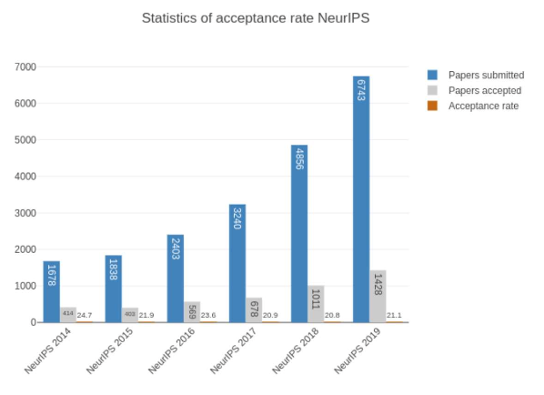
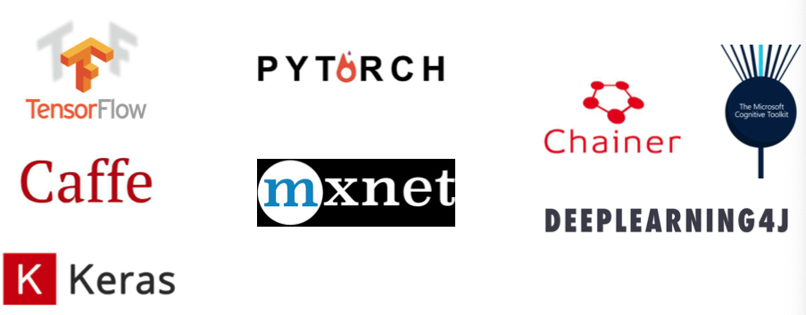

# 9. DNN
Property 1: Goodfellow6-9

# Deep Learning

- A machine learning subfield. Exceptional performance in learning patterns.
- Deep learning algorithms attempt to learn (multiple levels of) representation by using a hierarchy of multiple layers.
- If you provide the system tons of information, it begins to understand it and respond in useful ways.

- Manually designed features are often over-specified, incomplete and take a long time to design and validate
- Learned Features are easy to adapt, fast to learn
- Deep learning provides a very flexible, (almost?) universal, learnable
framework for representing world, visual and linguistic information.
- Can learn both unsupervised and supervised
- Effective end-to-end joint system learning
- Utilize large amounts of training data

## History

- In ~2012, deep learning (DL) started outperforming other machine learning (ML) techniques, first in speech and vision, then NLP

## Structure

어떻게 DL이 좋은 성능을 내는가?

- Fat + Short vs. Thin + Tall Networks
- The same number of parameters

- Deep → Modularization
- 

- Before 2006, deeper usually does not imply better performance.

- [Geoffrey Hinton showed how to train deep network in 2006 [1]](https://www.notion.so/9-DNN-4bd3fcaa9c98476dbe325f886d729985)
    - Learned layers one by one

- [Deep Neural Networks showed good classification performance with large image data set in 2012. [2]](https://www.notion.so/9-DNN-4bd3fcaa9c98476dbe325f886d729985)
    - GPU
    - Big data
    - Better learning algorithms

[http://www.gizmodo.com.au/2015/04/the-basic-recipe-for-machinelearning-explained-in-a-single-powerpoint-slide/](http://www.gizmodo.com.au/2015/04/the-basic-recipe-for-machinelearning-explained-in-a-single-powerpoint-slide/)

- Rectified Linear Unit (ReLU)
    - Fast to compute
    - Vanishing gradient problem

- [[Xavier Glorot, AISTATS’11] [3]](https://www.notion.so/9-DNN-4bd3fcaa9c98476dbe325f886d729985)
- [[Andrew L. Maas, ICML’13] [4]](https://www.notion.so/9-DNN-4bd3fcaa9c98476dbe325f886d729985)
- [[Kaiming He, arXiv’15] [5]](https://www.notion.so/9-DNN-4bd3fcaa9c98476dbe325f886d729985)

# Dropout

[Dropout [6]](https://www.notion.so/9-DNN-4bd3fcaa9c98476dbe325f886d729985)

- Each time before computing the gradients
- Each neuron has $p \times 100 \%$ chance to be dropped
    - The structure of the network is changed
- Use the new network for training

- Weights should be multiplied by (1-p) when testing

## Training stage

Assume dropout rate is 50% 

### Testing stage

No dropout

# Convolutional Neural Network

## Fully connected layer

- Example: 200x200 image * 40K hidden units → ~2B parameters

Slide Credit: Marc'Aurelio Ranzato

- Waste of resources + we have not enough training samples
- Spatial correlation is local

## Locally Connected Layer

- Example: 200x200 image * 40K hidden units → ~4M parameters (Filter size: 10x10)
Page 20- Spatial correlation is local

- Waste of resources + we have not enough training samples
- Spatial correlation is local

- Statistics is similar at different locations
    - Share the same parameters across
- different locations (weight sharing)
    - Convolutions with learned kernels
    

## Convolution operation

$F(m,n) = f * h = \Sigma_{l= -\frac w 2}^{\frac f 2}\Sigma_{k= -\frac w 2}^{\frac w 2} {f(m+k, n+l) *h(\frac w 2 -k, \frac w 2 -l)}$

- If a feature is useful in some locations during training, detectors for that feature will be useful in all locations during testing

## Pooling

- By “pooling” (e.g., taking max) filter responses at different locations, we gain robustness to the exact spatial location of features.

### Max-pooling

$h_i^n(r,c) = max_{\bar r \in N(r), \bar c \in N(c), } h_i^{n-1} (\bar r, \bar c)$

### Average-pooling

$h_i^n(r,c) = mean_{\bar r \in N(r), \bar c \in N(c), } h_i^{n-1} (\bar r, \bar c)$

### L2-pooling

$h_i^n(r,c) = \sqrt{\Sigma_{\bar r \in N(r), \bar c \in N(c), } h_i^{n-1} (\bar r, \bar c)}$

## Convolution kernel (filter) examples

- Examples of learned object parts from object categories
    
    
    

## LeNet-5 (1998)

[[7] Le-Net](https://www.notion.so/9-DNN-4bd3fcaa9c98476dbe325f886d729985)

- Yann LeCun and his collaborators developed a really good recognizer for
handwritten digits by using backpropagation in a feedforward net with
    - Many hidden layers (at that time),
    - 3 convolution layer,
    - 2 subsampling (pooling) layer
    - 5*5 convolution kernels,
    - ~340,000 connections,
    - ~60,000 parameter
- Used for reading ~10% of the checks in North America
    
    
    

## Backpropagation in CNN

- Same color shares the same weight
- Compute the gradients as usual, and then modify the gradients so that they satisfy the constraints

- The 82 errors made by LeNet5
- Notice that most of the errors are cases that people find quite easy.
- The human error rate is probably 20 to 30 errors.

- LeNet uses knowledge about the invariances to design:
    - local connectivity
    - weight-sharing
    - Pooling
    - ~ 80 errors
- Using many different transformations of the input and other tricks (Ranzato2008)
    - ~ 40 errors
- Using carefully designed extra training data (Ciresan 2010)
    - For each training image, they produced many new training examples by applying many different transformations
    - ~ 35 errors

[Ciresan 2010][8]

](9/Untitled_34.png)

PyTorch implementation of LeNet-5 for MNIST, [https://github.com/radsn/LeNet5](https://github.com/radsn/LeNet5)

- The top printed digit is the right answer.
- The bottom two printed digits are the network’s best two guesses.
- The right answer is almost always in the top 2 guesses.
- With model averaging they can now get about 25 errors.

# From Handwritten Digits to 3-D objects

- Recognizing real objects in color photographs downloaded from the web is much more complicated than recognizing hand-written digits:
    - Hundred times as many classes (1000 vs 10)
    - Hundred times as many pixels (256* 256 color vs. 28* 28 gray)
    - Two dimensional image of three-dimensional scene
    - Multiple objects in each image
    - Cluttered background
- Will the same type of convolutional neural network work?

# The ILSVRC-2012 Competition on ImageNet

- [9] ImageNet
    - Over 15 million labeled high-resolution images
    - Roughly 22,000 categories
    - Collected from the web
    - Labeled by human using Amazon’s Mechanical Turk crowd-sourcing tool

- ImageNet Large-Scale Visual Recognition Challenge (ILSVRC)
    - Uses a subset of ImageNet
    - 1,000 categories
    - 1.2 million training images
    - 50,000 validation images
    - 150,000 test images
- The classification task:
    - Get the “correct” class in your top 5 bets. There are 1000 classes.
- The localization task:
    - For each bet, put a box around the object. Your box must have at least 50%
    overlap with the correct box.
- Some of the best existing computer vision methods were tried on this dataset by leading computer vision groups from Oxford, INRIA, XRCE(XEROX), …
    - Computer vision systems use complicated multi-stage systems
    - The early stages are typically hand-tuned by optimizing a few parameters

## Examples from the test set (with the network’s guesses)

Error rates on the ILSVRC-2012 competition

|  | classification | classification & localization |
| --- | --- | --- |
| UToronto
 | 16.4%  | 34.1% |
| UTokyo | 26.1% | 53.6% |
| Oxford University Computer Vision Group
 | 26.9% | 50.0% |
| INRIA + XRCE | 27.0% |  |
| UAmsterdam | 29.5% |  |
- UToronto (deep learning - Alex Krizhevsky, AlexNet)
- INRIA (French national research institute in CS) + XRCE (Xerox Research Center Europe)

# A CNN for ImageNet

AlexNet[10]

- Alex Krizhevsky (NIPS 2012) developed a very deep convolutional neural net of the type pioneered by Yann LeCun.

- 7 hidden layers not counting some max pooling layers
- The early layers are convolutional, the last two layers are fully connected
- The activation functions are
    - Rectified linear units in every hidden layer. These train much faster and are more expressive than sigmoid.
    - Normalization for better activation
- Use “dropout” to regularize the weights in the fully connected layers
- 224*224 patches are taken from the 256*256 images (10 different versions) and leftright reflections are used to get more data
- Used all 10 different patches at test time

## More examples from AlexNet

## Hardware for AlexNet

- He uses a very efficient implementation of convolutional nets on two NvidiaGTX 580 Graphics Processor Units (over 1000 fast little cores)
    - GPUs are very good for matrix-matrix multiplies.
    - GPUs have very high bandwidth to memory.
    - This allows him to train the network in a week.
    - It also makes it quick to combine results from 10 patches at test time.
- We can spread a network over many cores if we can communicate the states fast enough.
- As cores get cheaper and datasets get bigger, big neural nets will improve faster than old-fashioned computer vision systems.

# Evolution of the DNN

- Network depths and the performance
- ILSVRC classification error (top-5 error)
    
    
    

# Fully Convolutional Networks

- Fully connected layer constrains the input image size
    
    
    
- Fully convolutional network structure has no constrains on the input image size
    
    
    

# Machine Learning, Deep Learning, Data Mining, Big data

## Big Data

- 기존 데이터의 크기 범주를넘어서는 규모(2010~)
- 기존 데이터 처리 이슈 공유
- 대용량 데이터 분산저장/처리 방법 필요

## Machine Learning

- 데이터의 속성을 일반적으로 분석하는 방법, 주로 분류/회귀 작업에 사용됨(1950~)
- 지도학습/비지도학습/군집화
- 체스 게임으로부터 발전

## Deep learning

- 심층 인공신경망 기술을 사용하는 기계학습 방법(2010~)
- 기존 기계학습 방법의 성능을 뛰어 넘음

## Data Mining

- 데이터에 내재된 속성을 분석 (1930~)
- 기계학습과 유사하나 데이터 간의 규칙을 분석하는 측면으로 차별화

## Some history

- Frank Rosenblatt, Perceptron (1957, 1962): Early description and engineering of single-layer and multilayer artificial neural networks.
    
    
    
- Kasparov vs Deep Blue, 1997
    
    
    
- Lee Sedol vs AlphaGo, 2016
    
    
    

### timelines

- 1943: Neural networks
- 1957-62: Perceptron
- 1970-86: Backpropagation, RBM, RNN
- 1979-98: CNN, MNIST, LSTM, Bidirectional RNN
- 2006: “Deep Learning”, DBN• 2009: ImageNet + AlexNet
- 2014: GANs
- 2016-17: AlphaGo, AlphaZero
- Turing Award given for:
    - “The conceptual and engineering breakthroughs that have made deep neural
    networks a critical component of computing.”
    • Yann LeCun
    • Geoffrey Hinton
    • Yoshua Bengio

## Limitations of Deep Learning

- Prediction from Rodney Brooks:
“By 2020, the popular press starts having stories that the era of Deep Learning is over.”

- 2019 is the year it became cool to say that “deep learning” has limitations.
- Books, articles, lectures, debates, videos were released that learning-based methods cannot do commonsense reasoning.

## Statics of acceptance rate NeurIPS

## Deep Learning Framework/Toolkits

## AlexNet

https://sushscience.wordpress.com/2016/12/04/understanding-alexnet/

---

[1] Geoffrey Hinton showed how to train deep network in 2006 

[2] Deep Neural Networks showed good classification performance with large image data set in 2012.

[[3] [Xavier Glorot, AISTATS’11]](https://www.notion.so/9-DNN-4bd3fcaa9c98476dbe325f886d729985)

Deep Sparse Rectifier Neural Networks. ***Xavier Glorot, Antoine Bordes, Yoshua Bengio***
 *Proceedings of the Fourteenth International Conference on Artificial Intelligence and Statistics.* PMLR 15:315-323, 2011.

- [https://proceedings.mlr.press/v15/glorot11a.html](https://proceedings.mlr.press/v15/glorot11a.html)

[[4] [Andrew L. Maas, ICML’13]](https://www.notion.so/9-DNN-4bd3fcaa9c98476dbe325f886d729985) 

Rectifier nonlinearities improve neural network acoustic models (2013) by Andrew L. Maas , Awni Y. Hannun , Andrew Y. Ng

[https://ai.stanford.edu/~amaas/papers/relu_hybrid_icml2013_final.pdf](https://ai.stanford.edu/~amaas/papers/relu_hybrid_icml2013_final.pdf)

[[5] [Kaiming He, arXiv’15]](https://www.notion.so/9-DNN-4bd3fcaa9c98476dbe325f886d729985) 

Deep Residual Learning for Image Recognition📹
by Kaiming He, Xiangyu Zhang, Shaoqing Ren, Jian Sun

[https://arxiv.org/abs/1512.03385](https://arxiv.org/abs/1512.03385)

[[6] Dropout: A Simple Way to Prevent Neural Networks from Overfitting](https://www.notion.so/9-DNN-4bd3fcaa9c98476dbe325f886d729985)

***Nitish Srivastava, Geoffrey Hinton, Alex Krizhevsky, Ilya Sutskever, Ruslan Salakhutdinov***; 15(56):1929−1958, 2014.

[6.2. DropOut](https://www.notion.so/6-2-DropOut-7f9244899e884b27969f212af344b6a1)

[Dropout: A simple way to prevent neural networks from overfitting (2014), N. Srivastava et al. [pdf]](https://www.notion.so/Dropout-A-simple-way-to-prevent-neural-networks-from-overfitting-2014-N-Srivastava-et-al-pdf-b70dbe733db749bfbff250abeb9813e4)

[https://jmlr.org/papers/v15/srivastava14a.html](https://jmlr.org/papers/v15/srivastava14a.html)

[[7] Le-Net](https://www.notion.so/9-DNN-4bd3fcaa9c98476dbe325f886d729985)

[http://vision.stanford.edu/cs598_spring07/papers/Lecun98.pdf](http://vision.stanford.edu/cs598_spring07/papers/Lecun98.pdf)

[5.1. **LeNet**](https://www.notion.so/5-1-LeNet-8a448781423b4a3591b77dd91d76a272)

[8] [Ciresan 2010]

[9] ImageNet

[ImageNet](https://www.notion.so/ImageNet-67d9a42cba374a83afb7836c48e304f6)

ImageNet: A large-scale hierarchical image database

by Jia Deng; Wei Dong; Richard Socher; Li-Jia Li; Kai Li; Li Fei-Fei