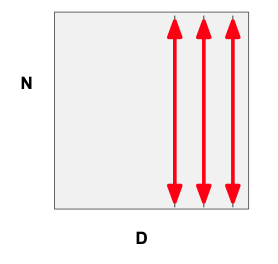
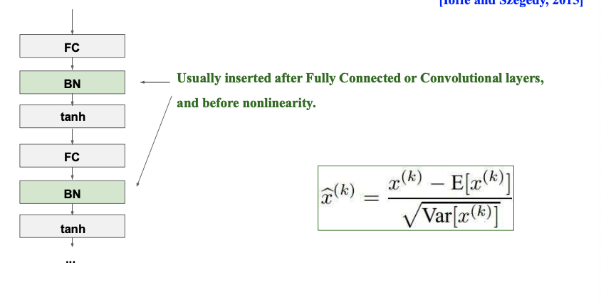
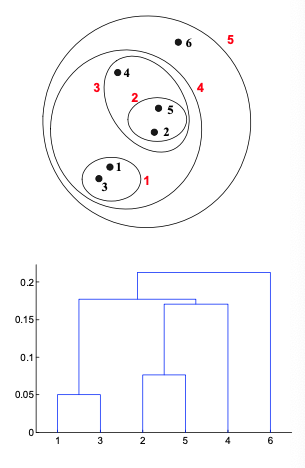

# [Final Repkg. for ML]

# 7. kNN

[7. k-Nearest Neighbor](https://www.notion.so/7-k-Nearest-Neighbor-abad63e2757e4de39af29914c4c63e82)

- **kNN = Instance based learning**
    
    주어진 test sample X에 대하여, kNN samples (xn1, yn1) … (xnk, ynk)를 위치시켜 majority class label yn1, .. ynk를 xt에 assign한다.
    
- **kNN pros and cons**
    - pros :
        - training is very fast : feature extraction and save
        - learn complex target fn
        - doesn’t lose info
    - cons :
        - slow at test  → not goot
        - requires large storage
        - not robust against irrevalent attributes, outliers
- **Distance Metrics**
    - kNN - test 시점 ) data와 Near한지 distance 계산
    - distance : 모든 Classification , regression에서 중요
        - 단 Nominal data다루는 DT에서는 불필요
        - similiarity와 반비례
    - Euclidean distance : $\sqrt{\Sigma_{d=1}^{D} |x_{td} - x_{nd}|^2}$
    - Manhattan distance : ${\Sigma_{d=1}^{D} |x_{td} - x_{nd}|}$
    - $L^n$-norm : $\sqrt{\Sigma_{d=1}^{D} |x_{td} - x_{nd}|^n}$
    
    - When we say ‘nearest’, it depends on the distance metric :
        - Euclidean distance : $\sqrt{\Sigma_{d=1}^{D} |x_{td} - x_{nd}|^2}$
        - Manhattan distance : ${\Sigma_{d=1}^{D} |x_{td} - x_{nd}|}$
        - $L^n$-norm : $\sqrt{\Sigma_{d=1}^{D} |x_{td} - x_{nd}|^n}$
        
    - Each dimension can be differently **scaled**
        - Each dimension may have different impact
        - May **bias** the performance of the classifier $\sqrt{\Sigma_{d=1}^{D} w_d|x_{td} - x_{nd}|^2}$
            - 동일한 기준 측정 X → performance bias 발생 가능
            - weight를 특정 feature에 넣어 거리의 상대적인 크기를 feature에 따라서 넣는다
- **VDM**
    
    provide d measurements for nominal attributes
    
- **Problem from Euclidean distance**
    1. High dim data - curse of dimensionality
        - 너무 많이 feature, attrib 증가시킬 경우 dim이 너무 많이 증가해 차원의저주
        - sample로부터 available info 가 많고 정확하다면 dim 높아도 괜찮음
    2. 보통 sparse하고 density를 shrink하여 적용한다.
    3. 과연 d가 동일하다고 data feature를 잘 나타낼까?
        - MSB, LSB 등 bit 연산으로부터 잘 표현이 안될수도 있음
        - Hamming d.
- **Behavior of limit**
    
    $\lim _{n \rightarrow \infty} \leq 2 \epsilon ^*$
    
    pf) goodnote 참고
    
- **Standardization**
    
    z = x - mu / sigma
    
- **how to choose k**
    - k is too small → sensitive to noise points
    - k is too big → neighborhood may include pts from other classes
        - smoother when k get bigger
    - 보통 $k = \sqrt N$
    - $n \rightarrow \infty$, k gets larger → good performance as good as bayes classifier
- **Cross Validation !!!**
    - N fold cross validation → k to minimize cross valid error
    
    overfitting에 의해 - train error를 줄이는 것이 무작정 좋지는 않다
    
- **Condensing!!!**
    - [Aim] reduce the number of training samples
    - Decision boundary consistent : same with entire training set
        - min. consistent set : smallest subset of samples
    
    1) init subset with single ex. 
    → 2) nearest neighbor 생성, epsilon나오는 incorrected samples 선택 
    → 3) 2)반복 Until no transfers or subset is full → result 구하기
    
- **Voronoi Diagram**
    - Voronoi Diagram : div space into such cells : 구획으로 나누고 boundary 영향없는 sample del
    - Delaunary triagulation 생성 → circumcircle center pt 끼리 연결 : 
    각 sample pt class에 따라 전체 영역 Class 결정
        - Delaunary triagulation : 삼각형의 세 점에 외접하는 삼각형, 각도 최대화
        - not unique
    - 

# **8. ANN**

[8. ANN](https://www.notion.so/8-ANN-2866fb8a17b645a1af86f8a713f28c3d)

- **Differences with**
    - Similar : SVM처럼 high dimension mapping과 유사한 input layer to hidden layer
        - 원래 feature space에서는 not linearly separable → phi fn(high dim) 으로 sol
    
- **Bitwise Calc.**
    
    perceptron : AND, OR연산 가능하나 XOR 불가능 
    
    - sol: XOR이 nonlinear해서 생긴 문제 : 2 Decision boundary
- **ANN Training**
    - input - hidden - output : hidden layer 수에 따라 네트워크 구조가 좌우되며 linearly nonsolvable 문제도 해결해낼 수 있다
    - 1) decide input /output / hidden layer node number 
    → 2) find weight using training alg (backpropagation)
    - #class = #node
- **Backpropagation**
    - (등장배경) NN-SVM-DNN에서 SVM이 많이 쓰이는 경우였음. NN에서 overfitting / XOR문제
    - (Idea) Weight w를 Error 감소하는 방향으로 Update - between prediction vs ground truth val
    - (prob. similar to perceptron) stuck in local minima, iteratively get w, many w to get y
    - chain rule
- **Vanishing Gradient Problem**
    
    error들이 backpropagate하면 gradient가 vanish하는 현상 : layer에서 소수점이 곱해질수록 0으로 수렴하기 때문이다. w = w - eta dE/du
    
    - sol : requires lots of data
    - nonlinear ReLU
    - Layerwise learning : 충분히 학습되면 넘어감
- **Overfitting**
    - Only get good result for train data only
    
    get stuck in local minima 
    
    - solution : randomly set initial val +many data + much computation power→ train many times → avg 추출
    
    good model check
    
    - solution : train data, test data 변화시키며 stable result를 보이는지 확인한다

# 9. DNN

[9. DNN](https://www.notion.so/9-DNN-4bd3fcaa9c98476dbe325f886d729985)

- **Why is better than traditional ML**
    - SVM) Manual, Human supervised, div and conquer
        - 기존에 human이 feature extraction한 후 classification함.
        - SVM에서는 Hand-crafted phi fn을 활용해서 alg에서 Pattern이 더 잘 보이도록 수정했다
    - DL) Automatical, end-to-end NN
        - end-to-end joint system : NN이라는 hierarchical structure로 feature extract + classification 과정 수행
            - → data를 지속적으로 분류 : 자체적으로 자동적으로 배우고 지능적인 결정 수행
        - modularization : automatically learned from data (each classes)
- **DNN consist**
    - input layer + multiple hidden l + output layer
- **(CNN) Layers : FC Layer, Locally connected layer**
    
    corelation 구하는 작업 → 조합을 다음 layer로 전달한다.
    
    - FC : globally corelated - rsrc waste, too much calc., not enough data to train pm
    - LC : 일정 convolution내 node (different locations-convolutions with learned kernel)
        - convolution : 특정 Window size filter
- **(CNN) Conv. operations**
    - Conv A * B = B * A
    - cross-corelation : A . B ≠ B . A
    - auto-correlation : 자기 자신과 동일
- **(CNN) Pooling**
    
    filter responses at different location → robustnest to spatial location of filters
    
    - max, avg, l2 pooling
- **(CNN) size of feature map 계산**
    
    
- **tasks**
    - Classification : exact class 분류
    - Localization : obj 주변에 box를 두고 정답과 적어도 50%이상 겹쳐야 함
    - Obj Detection : n개의 obj에 모두 boundary box 처리
    
- **Alexnet**
    - act. fn. : ReLU in Hidden layers → faster, expressive than sigmoid
    - ten different 224*224 patches from from 256*256 img
    - dropout to reg. weight in FC layers
    - padding
- **FC Layer**
    
    has no constrains the input img size (상관 없음)
    
- **DNN Evolution**
    
    NN - Perceptron - Backporpagatino ,RNN, RBM - CNN, MNIST, LSTM, BRNN - DBN - GAN - AlphaGo
    
    - data labeled
    - obj detection focused
    - GPU
        - good for mat*mat multiplies + high bandwidth
    - shallower
- **Backgrounds**
    - HW (GPU) + Data (Big data) + Alg (learning Alg)
    - limit : cannot do commonsense reasoning - 상식, 윤리의 Lack

# 10. DNN2

[10. DNN 2](https://www.notion.so/10-DNN-2-c5c97bb69d724e25bb655b70f34d2575)

- **Data Processing**
    
    
    In practice, you may also see PCA and Whitening of the data
    
    PCA : dimensionality reduction, clustering (unsupervised)
    
    - decorrelated data
        - (data has diagonal covariance matrix)
        - axis방향으로 평행 : with x1 only (1dim)
        - from 2dim → 1dim compression (data info loss)
    - whitened data
        - (covariance matrix is the identity matrix)
            
            $\Sigma =$
            
        - acc 변화했을 수도 있으므로 performance 체크
- **Weight Init.**
    
    
    “Xavier initialization” [Glorot et al., 2010]
    
    ```python
    W = np.random.randn(fanin, fanout) / np.sqrt(fanin)
    ```
    
    - Reasonable initialization. (Mathematical derivation assumes linear activations) with tanh fn
    - 현재 layer node의 sqrt로 init
    - but when using the ReLU nonlinearity it breaks. (0에 접근)
    
    He et al., 2015 (note additional /2)
    
    - error가 더 잘 감소됨을 확인할 수 있음
    
    ```python
    W = np.random.randn(fanin, fanout) / np.sqrt(fanin/2)
    ```
    
- **Batch Normalization**
    
    
    - To make each dimension unit gaussian, apply:
        - $\hat x^{(k)} = \frac{x^{(k)} - E[x^{(k)}]}{\sqrt{Var[x^{(k)}]}}$
            - this is a vanilla differentiable function...
    - dimension 단위 normalilze
    
    1. compute the empirical mean and variance independently for each dimension.
        
        
        
    2. Normalize
        - $\hat x^{(k)} = \frac{x^{(k)} - E[x^{(k)}]}{\sqrt{Var[x^{(k)}]}}$
    - Usually inserted after Fully Connected or Convolutional layers, and before **nonlinearity.**
    
    
    
    - Normalize:
        - $\hat x^{(k)} = \frac{x^{(k)} - E[x^{(k)}]}{\sqrt{Var[x^{(k)}]}}$
        - $\hat x \sqrt{Var} + E[x] = X$
        - $\gamma = \sqrt{Var} , \beta = E[x]$
        - $\hat x$ : normalized data, X : original data
    - And then allow the network to squash the range if it wants to:
        - $\hat y^{(k)} = \gamma^{(k)} \hat x^{(k)}+\beta^{(k)}$
    - Note, the network can learn:to recover the identity mapping.
        - $\gamma^{(k)} = \sqrt{Var[x^{(k)}]}$ (stretch)
        - $\beta^{(k)} = E[x^{(k)}]$ (이동)
        
    - $X \rightarrow \hat X$ : normalize : $\gamma, \beta$로 scaling된 y value
- **Regularization**
    
    
    $$
    L = \frac 1 N \Sigma_{i=1}^{N} \Sigma_{j\neq y_i}{\max(0, f(x_i);W)_j - f(x_i);W)_{y_i} +1} + \lambda R(W)
    $$
    
    - Loss Fn : $\frac 1 N \Sigma_{i=1}^{N} \Sigma_{j\neq y_i}{\max(0, f(x_i);W)_j - f(x_i);W)_{y_i} +1}$
    - Lambda weight term $+ \lambda R(W)$
    
    
    
    - In common use:
        
        
        
- **Dropout**
    - (배경) deep NN 일수록 특정 node가 학습 시 dropped case 발생
    - (train) assume dropout rate p → (test) no dropout
- **regularization common pattern**
    
    
    - Cross Entropy Loss : $-\Sigma y_i \lim P_i$
        - yi : the answer
        - Pi : prediction
    - Training: Add some kind of randomness
        - randomness - regularize
        - $y = f_W (x,z)$
    - Testing: Average out randomness (sometimes approximate)
        - $y = f(x) = E_z[f(x,z)] = \int p(z)f(x,z)dz$
        - iteration별 여러 mu, sigma → average를 구하여 test시점에 적용한다
        - BN도 regularization작업
    - Example:BatchNormalization
        - Training:Normalize using stats from random mini batches
        - Testing:Use fixed stats to normalize

# 11. Ensemble learning

[11. **Ensemble Learning**](https://www.notion.so/11-Ensemble-Learning-afd95182fd9c4803b961642026442403)

- Ensemble Learning
    1. 
- Generate Ensembles
    
    
    - Data Manipulation
        
        1. Train set에 변화
        
        Supervised learning에서 train set에 대해 train 되어 얻어진 model
        
        - 다른 train set을 사용하면 -> 다른 model : 분류 성능이 다름
        - it changes the training set in order to obtain different models
    - Modeling process manipulation
        
        2. algorihtm에 변화
        
        - model process manipulation : algorithm의 변화
        - parameter만 변화하는 경우도 있고, classifier 자체를 변경할수도 있음, algorithm 자체를 변화시킬수도 있고
        - → 다양한 model (f1 _ /// fk)
        - it changes the induction algorithm, the parameter set or the model in order to obtain different models
- **Ensemble learning via negative correlation learning:**
    - Generating sequentially new predictors **negatively correlated** with the existing ones
        - 현재 classifier하고 negative corelation갖는 classifier를 학습하여 융합한다
- Bagging
    - Averaging the prediction over a collection of predictors generated from **bootstrap samples** (both classification and regression)
        
        bootstrap sample :trian data있으면 subset sampling
        
        - 각각 sampling으로부터 classifier 학습
            
            Random하게 sampling하며 다양한 model
            
    
    - Training
        - Given a set D of d tuples, at each iteration i, a training set $D_i$ of $d$ tuples is sampled with replacement from D (i.e. bootstrap)
            - bootstrap 방법 : sampling with replacement - 전체 dataset으로부터 sampling하여 modeling하고 다시 복원
            - 각각의 data subset에 대하여 model을 만듬
    
    average, Sum 은 같은 방식 : sum에서 classifier number만큼 나눠주면 average value
    
    - bootstrapping = original data로부터 sampling
    - aggregating = 그것들로부터 각각의 classifier를 만들어 병합하는 방법
    - Classification: classify an unknown sample X
        - Each classifier $M_i$ returns its class prediction
        - The bagged classifier $M^*$ counts the votes and assigns the class with the most votes to X
            - 각 classifier가 sample에 대한 class 예측값을 계산하고, 그리고 최종 판단은 voting / sum/ 등 여러 방법을 사용할 수 있다.
    - Prediction:
        - can be applied to the prediction of continuous values by taking the average value of each prediction for a given test tuple
        
    
    - Accuracy
        - Often significantly better than a single classifier derived from
            
            significantly better : 5 ~ 10% 상승
            
            - 물론 model을 여러번 쓰고 연산량은 그만큼 증가
            - test stage : Test sample에서는 model들 다 유지해서 그만큼 분류 작업 수행 후 융합
            
            Train + test stage 연산량 증가
            
        - For noisy data: not considerably worse, more robust
            - noisy data : robust하게 됨 (boost sampling : Noisy data가 빠진 형태로 학습)
        - Proved improved accuracy in prediction
    - Requirement: need unstable classifier types
        - Unstablemeansasmallchangetothetrainingdatamayleadtomajor decision changes
        - requirement : unstable classifier
        
        Unstable : train data를 조금 바꿀 경우 model decision이 크게 바뀌는 model을 의미함
        
        (Remind) Model이 바뀐 train data에 대해서 diverse한 error = variance가 커야 한다.
        
        - bagging의 관점에서는 var 큰게 좋다 (일반적으로는 별로 안 좋다)
    
    - Stability in Training
        - Training: construct classifier from
        - Stability: small changes on results in small changes on
            
            Training : f를 d로부터 형성
            
        - Decision trees are a typical unstable classifier
- Boosting
    - Weighted vote with a collection of classifiers that were trained sequentially from training sets given priority to instances **wrongly classified**
        
        Boosting : 여러 단계를 거쳐 classifier 학습
        
        - 이전 단계의 classifier의 오답에 초점을 맞춘다.
        
        오류가 나오는 data들을 모아 다음 stage에서 초점을 맞추어 학습하여 융합한다
        
    
    - Incrementally create models selectively using training examples based on some distribution.
        - Incrementally하게 sample이 subset으로 selection된 확률값을 가지고 있음
    - How boosting works?
        - Weights are assigned to each training example
        - A series of k classifiers is iteratively learned
        - After a classifier $M_i$  is learned, the weights are updated to allow the subsequent classifier, $M_i +1$, to pay more attention to the training examples that were misclassified by
        - The final $M^*$ combines the votes of each individual classifier, where the weight of each classifier's vote is a function of its accuracy 𝒊
    - 각 sample들이 weight를 가지고 있음.
    
    그리고 우리는 k개의 classifier를 학습할 것
    
    그런데 M_i가 학습 된 다음, classifier가 학습된 이후에는
    
    weight을 update하는데 앞 단계에서 학습된 model들이 misclassified 에 더 주의를 기울인다 (weight를 올린다)
    
    - > higher chance to be selected
    
    즉 misclassified sample들이 점점 그 쪽으로 select되면서 hard sample들이 점점 추가되어 뒤쪽 classifier 학습
    
    1~k개 classifier를 조합하여 m*
    
    - weighted combination : weight는 accuracy에 비례
    - boosting 기본 아이디어 : disagreement, hard sample
    
    Hard sample에 초점 맞추는 방법 : classifier 1번을 만들고 misclassified에 대해서 classifier 2번을 만들고 m1, m2가 다른 결정을 내리는 sample에 대해서 classifier 3번을 만들어 test sample이 들어오면 m1, m2를 돌려 최종 결과로 사용하고 두 분류기 결과가 다르면 m3를 활용하여 결과 도출
    
- Boosting - Adaboost
    
    
    - Using Different Data Distribution
        - Start with uniform weighting
        - misclassified sample의 weight 증가
        - well classified sample에 대해서는 weight 감소
        - During each step of learning
            - Increase weights of the examples which are not correctly learned by the weak learner
            - Decrease weights of the examples which are correctly learned by the weak learner
    - Idea
        - Focus on difficult examples which are not correctly classified in the previous steps
        - difficult example에 더 주의를 기울인 케이스
    
    - Weighted Voting
        - Construct strong classifier by weighted voting of the weak classifiers
        - 
        - strong classifier 만들 때 weak classifier 에 weight를 주고 weighted voting / weighted sum 등 일반적인 ensemble 방법 적용
        - weak classifier를 많이 첨가하여 combined classifier의 accuracy 증가 (strong classifier/learner)
    - Idea
        - Better weak classifier gets a larger weight
        - Iteratively add weak classifiers
            - Increase accuracy of the combined classifier through minimization of a cost function Ensemble Learning Adaboost Introduction to Machine Learning Page 17
- Adaboost vs Boosting
    
    
    - Differences with Bagging:bagging과의 차이점
        - Models are built sequentially on modified versions of the data
            - random하게 sample된게 아니라 weight에 의해 sample된 data에 의해 학습
        
        - The predictions of the models are combined through a weighted sum/vote
            - 점점 hard sample에 대해 학습되니 easy sample / hard sample의 classifier가 동일한 weight를 가질 수 없음 : bagging은 동일한 조건으로 randomly sampling (no weight)
                - 거의 동등한 조건이기 때문에 weight를 주지 않음
                - boosting의 경우 misclassified에 대해 overfitting (hard sample이 증가하는 방향으로 weight update)-> ensemble하면 점점 hard sample 추가되며 overfitting 위험
- Random Forest
    
    RandomForest:
    
    - Averaging the prediction over a collection of trees constructed using a **randomly selected subset of features**
        - tree를 randomly생성하여 randomly select해서 만든다.
    
    - Random Forest: A variation of the bagging algorithm - bagging처럼 여러 개 ensemble
    - Created from individual decision trees
        - Diversity is guaranteed by selecting randomly at each split, a subset of the original features during the process of tree generation
        - **tree 구조 : unstable 구조 → diversity가 guaranteed됨 automatically**
    - R.F 활용
        - During classification, each tree votes and the most popular class is returned
            - classification에서는 : vote를 가장 많이 받은 class가 최종 결과 decision
        - During regression, the result is the averaged prediction of all generated trees
            - regression에서는 :각 tree들이 result을 만드는데 이를 average 취하면 random forest result
    - random selection이 : feature selection / data sampling
- Heterogeneous ensembles:
    - Combining a set of **heterogeneous predictors**
        - NN + SVM + DT 등 융합
- Model Selection
    
    
    - Golden rule: there is no algorithm that is the best one for all the problems
        - 하나의 특정 알고리즘이 다른 모든 problem 모두를 해결하지는 않는다
    - Typically, two approaches (or both) can be adopted:
        - To choose the algorithm more suitable for the given problem
        - To adapt the given data for the intended algorithm (using pre-processing, for instance)
            - 주어진 data를 잘 tuning할 수 있도록 한다 for 사용하고자 하는 algorithm (preprocessing)
    - The concept of “good algorithm” depends on the problem:
        - good algorithm : prob by prob
        - Explainability : model이 어떤 판단을 내린다면 판단의 정확도도 중요하나 그 결정의 이유도 중요함 : bayesian, decision tree는 쉽게 설명할 수 있는데 그 외에는 설명이 쉽지 않음
        - 분류 관리 문제에 있어서는 이송 시간 예측 정확도가 가장 중요한 선택요인
        - For a doctor, the interpretation of the model can be a major criterion for the selection of the model (decision trees and Bayesian networks are very appreciated)
        - For logistics, the accuracy of travel time prediction is, typically, the most important selection criterion.
- Statistical Validation

# 12. Clustering

[12. Clustering](https://www.notion.so/12-Clustering-68dc57c409b94b27afd366a66f7d672c)

- **K-means clustering**
    
    
    An iterative clustering algorithm
    
    - Initialize: Pick K random points as cluster centers
        
        0. cluster의 개수 가정 : k개의 cluster = k개의 random point 초깃값 assume
        
    - Alternate:
        1. Assign data points to closest cluster center
            
            1. k개의 pt에 대해서 각각의 data들을 가장 가까운 cluster center에 할당하고
            
        2. Change the cluster center to the average of its assigned points
            
            2. Cluster center update : 각 iteration마다 update
            
            - 더 이상 update되지 않는 시점에서 cluster 중단
    - Stop when no point assignments change
        
        초깃값에 대해서 (initial center point) partition 나눔
        
        - 그 data들의 center mean을 구해서 이로 center를 update함
        - 이를 기반으로 update된 값들의 member들을 재할당
        - 반복하다 보면 각각의 cluster의 center로 이동하게 됨
- **K-means clustering properties**
    
    
    ## Properties of K-means algorithm (convergence)
    
    - Objective
        
        모든 sample들에 대해서 center값을 계산 :sample들의 center 값으로부터의 거리 제곱의 합이
        k개의 cluster에 대해서 최소
        
        - cluster center에 잘 일치하게 되면, 해당 cluster에 속하는 sample들이 그 cluster center 와 이루는 거리의 합이 모든 cluster에 대해서 minimum이 됨
        
        $$
        \min_{\mu} \min_{c}  \Sigma_{i=1}^{k} {\Sigma_{x\in C_i}|x-\mu_i|^2}
        $$
        
    - Fix $\mu$, optimize $C$
        
        iteration작업- partition update
        
        - mu 고정, C optimize
        - center까지의 모든 sample들의 거리를 최소화하는 작업
        
        $$
        \min_{c}  \Sigma_{i=1}^{k} {\Sigma_{x\in C_i}|x-\mu_i|^2} = \min_{c}  \Sigma_{i=1}^{n} {|x_i-\mu_{xi}|^2} 
        $$
        
    - Fix $\mu$, optimize $\mu$
        
        Partition update후 center값 update
        
        - 각 cluster sample들에서 sample들로부터 center 거리를 최소화시킬 수 있도록 평균값 설정
        - mu에 대해서 미분하고ㅡ 이를 0으로 setting하면 평균값이라는 것은 각 cluster에 속한 sample들의 값의 합을 그 cluster에 속한 sample들의 값의 합을 그 cluster에 속한 sample들의 개수로 나눈 값이 그 center 값 : center mean
        
        $$
        \min_{\mu} \Sigma_{i=1}^{k} {\Sigma_{x\in C_i}|x-\mu_i|^2}
        $$
        
        - Take partial derivative with respect to $\mu_i$and sets to zero, we have $\mu_i = \frac 1 {C_i} \Sigma_{x\in C_i} x$
    - K-means takes an alternating optimization, each step is guaranteed to decrease the objective – thus guaranteed to converge
- **Agglomerative clustering**
    
    
    - Agglomerative clustering
        - First merge very similar instances
            - 비슷한 data끼리 grouping : 처음에는 모든 data pt가 개별 cluster로 되고 점차 하나의 group이 될 때까지 group화
        - Incrementally build larger clusters out of smaller clusters
            - 가장 similarity가 큰 data끼리 group화함 :
                - 1,3을 하나의 group으로 묶고 2, 5 group으로 묶이게 되면 1st-2nd group간 거리는 가장 가까운 거리로 할 것인지 (1-2) 먼 거리로 할 것인지 (3-5) 평균으로 할 것인지에 따라, similarity 판단 기준에 따라 clustering이 다르게 됨
    - Algorithm:
        - Maintain a set of clusters, Initially, each instance in its own cluster
        - Repeat:
            - Pick the two closest clusters
            - Merge them into a new cluster
            - Stop when there’s only one cluster left
    - Produces not one cluster, but a family of clusters represented by a dendrogram
    
    
    
    - How should we define “close” for clusters with multiple elements?
        - similarity를 어떻게 판단할 것인가  =(distance를 어떻게 계산할 것인가)
        - closest / Farthest / Average → cluster가 달라지게 됨
            
            
            
    - Many options:
        - Closest pair (single-link clustering)
        - Farthest pair (complete-link clustering)
        - Average of all pairs
    - Different choices create different clustering behaviors
- **Agglomerative clustering - hierarchical clustering : strength, complexity**
    
    
    ## Strengths of Hierarchical Clustering
    
    - No assumptions on the number of clusters
        - cluster 개수 가정하고 수행하게 됨
        - 단) cluster 개수 잘못 예측하면 algorithm 좋지 않은 결과를 낼 것
        - Any desired number of clusters can be obtained by ‘cutting’ the dendogram at the proper level
    - Hierarchical clusterings may correspond to meaningful taxonomies
        - cluster 몇 개인지 모르는 상태에서 clustering
        - clustering : dendrogram 그려서 duration 긴 구간을 판단하여 cluster 개수 결정 / 적절한 상태에서 dendrogram cutting
        - 대칭적 분류 : phylogeny. Catalog
        - Example in biological sciences (e.g., phylogeny reconstruction, etc), web (e.g., product catalogs), etc.
    
    ## Complexity of hierarchical clustering
    
    - Distance matrix is used for deciding which clusters to merge/split
        - distance <-> proximity
    - data point n개가 있다면, n by n개 distance를 모두 계산함 : n^2 연산
        - At least quadratic in the number of data points
            - Not usable for large datasets
    
    group화가 진행되며 Matrix 크기가 점차 줄어들게 되어 최종적으로 하나의 block만 남게 됨
    
- **Closest pair (single-link clustering)**
    
    
    - Each cluster is a set of points
    - How do we define distance between two sets of points
    - Lots of alternatives
    - Not an easy task
    
    - Single-link distance between clusters Ci and Cj is the minimum distance between any object in Ci and any object in Cj
        - Single link : shortest distance
    - The distance is defined by the two most similar objects
        
        $$
        D _{s l} ( C _i , C _j ) = \min _{x , y} (d ( x , y )| x \in C _i , y \in C _j ) 
        $$
        
    
    # Single-link clustering: example
    
    - Determined by one pair of points, i.e., by one link in the proximity graph
        
        Diagonal value를 보고 판단할 수 있음
        
        같은 요소에 대한 값이 1-> similarity
        
        - data 분포에 의하면 1,2,3,4,5 clustering
        - symmetric : 대각선 아래 부분은 크게 의미가 없음
        - 값이 높은 순대로 먼저 cluster를 형성하게 됨
- **Farthest pair (complete-link clustering)**
    
    
    ## Distance between two clusters
    
    - Complete-link distance between clusters Ci and Cj is the maximum distance between any object in Ci and any object in Cj
    - The distance is defined by the two most dissimilar objects
        
        가장 먼 거리의 simple pair에 대해서 data를 clustering (Most dissimilar)
        
        Most similar
        
    
    $$
    D _{s l} ( C _i , C _j ) = \max _{x , y} (d ( x , y )| x \in C _i , y \in C _j ) 
    $$
    
    ## Complete-link clustering: example
    
    - Distance between clusters is determined by the two most distant points in the different clusters
        
        거리 판단한 이후(차이-dissimilar)
        cluster끼리 병합할 때는 가장 가까운 것 끼리 (동일)
        
- **Average of all pairs**
    
    
    # Distance between two clusters
    
    - Group average distance between clusters Ci and Cj is the average distance between any object in Ci and any object in Cj
        - 전체 data pair의 average 이용
        - I cluster , j cluster : 평균 distance 계산한 후 shortest path 결정
    
    $$
    D_{avg} (C_i, C_j) = \frac 1 {|C_i| \times |C_j| } \Sigma_{x\in C_i, y \in C_j} d(x,y)
    $$
    
- **statistical validation**

# 13. Dimensionality Reduction

[13. Dimensionality Reduction ](https://www.notion.so/13-Dimensionality-Reduction-c21c309ea0724478ba6924d6ce913f81)

- **Goal of Dimensionality Reduction**
    
    Visualization 용이 : 3dim 이하로 Reduct → visualize easy
    
    Performance 향상 : easy to handle data
    
    Computation cost 감소 
    
- **Data Compression**
    
    (필요성) Too high dimension of detection windows : computationally intensive
    
    - Cannot handle them : too high dimensionality → pixel diminish시켜 사용
    - Curse of dimensionality : 너무 Data dimension이 높아지면 accuracy가 떨어지는 현상
        - boolean이 아닌 Observed value (measured) : boolean이 아니라 acc 떨어질 수 있음
- **Feature Extraction**
    
    (과정) very high-dim raw data → feature extraction dimension reduction → classifier
    
- **dimension reduction**
    
    axis에 projection한 형태로 reduct dimension
    
- **왜 좌표축을 rotate한 것이라고 표현하는가? (multivariate dataset into new config)**
    - simplify data
    - easy to look at rel. between variable - patterns of units
- **PCA process**
    - [goal] find k-dim projection  which preserves best variance
    
    1. compute mean vector $\mu$ and covariance matrix $\Sigma$ of original data 
        1. D-dim data로부터 Mean, Covariance 구함
        2. $X = [X1, X2, … , Xn]$
        3. (mean centered X) $X_{\mu_0} = X-\mu = [X1-\mu, X2-\mu, … , Xn-\mu]$
        4. $\Sigma = X_{\mu_0} X_{\mu_0} ^T = \frac 1 n  \Sigma (X_i - \mu)(X_i - \mu)^T$
        5. $S = \Sigma(X_i - \mu)(X_i - \mu)^T$
        6. $\Sigma v = \lambda v$
    2. Compute eigenvectors and eigenvalues of $\Sigma$ 
    3. Select top k eigenvectors
        1. Top k개 eigenvalue에 대응하눈 eigenvector 구함
    4. Project points onto subspace spanned by them 
        1. $y = A(x-\mu)$
        2. where y is the new data, x is the original data, and the rows of A are the eigenvectors
    5. When we said the eigenvector as 
    
    
    
    in the previous lecture, $A$ is $V^T$ (k vectors, $v_1$ … $v_k$)
    
- **PCA  - Eigenvalue, vector의 의미?**
    - **eigenvector :PCA분석을 했을 때 data가 가장 크게 분산된 방향으로 표현하는 방향벡터이고 그 정도를 가리키는 것은 eigenvalue.**
    - smaller eigenvalue 순 - eigenvector 정렬 → 크게 var되는 방향으로 정렬
    - 가장 큰 eigenvector로 하여 좌표축을 변환해도 data들이 잘 표현이 됨
        - data를 Eigenvector에 Projection : 새로운 좌표값으로 나오게 됨
    
    - Covariance matrix :
        - d dimension data로부터 d개의 eigenvector
        - 2차원 data로부터 2개의 eigenvector, eigenvalue
        - 
    - **The eigenvectors of $\Sigma$ define a new coordinate system 
    (새로운 coordinate system으로 적용)**
        - Eigenvector with largest eigenvalue captures the **most variation** among data X
            - **eigenvector :PCA분석을 했을 때 data가 가장 크게 분산된 방향으로 표현하는 방향벡터이고 그 정도를 가리키는 것은 eigenvalue.**
        - Eigenvector with smallest eigenvalue has least variation
            - **가장 작은 eigenvalue에 대응되는 Eigenvector는 분산이 제일 작다.**
            
            
            - v1이라는 axis로 투영한다면 Data가 가장 잘 분산되는 최적의 방향이다 → 최대 분산 방향으로 압축되면 제일 잘 분산되는 방향으로 data의 차원을 축소시키는 것이기에 원본 Data 정보 잘 반영
        - Dimension reduction에 따른 원본 data의 information loss정도
            - 1Dim 압축 : 가장 최소 eigenvector, 2Dim 압축 : 두 번째eigenvector
            - d dim에 대해서 D개를 모두 사용 → 어떠한 손실도 없이 원본 Data 수행 가능
                1. 표현된 Data는 동일하지만 PCA 분석이 되어 있기에 Dimension을 줄이면 됨
                2. corelation이 감소된 형태로 좌표축 정립 : x1의 값이 변화할 때 x2의 값이 변화되는 정도
- **LDA**
    
    LDA : labeled 
    
    - PCA는 unsupervised learning에서 clustering, dimensionality reduction
        - Not for classification
    - LDA는 supervised learning, dimensionality reduction
        - Classification을 위해 쓸 수 있으나 label 사용해서 unsupervised라고 볼 수는 없음
    
    LDA의 필요성
    
    - PCA maximizes the total scatter → PCA does not consider class information
        - PCA 분석 하면 data의 최대 분산 방향으로 eigenvector가 얻어지게 됨
        - 최대 분산 방향으로 data 투영하게 되면 data label 구분이 없어짐 (섞임)
- **PCA vs. LDA**
    
    
    - PCA maximizes projected total scatter
    label이 없으니 전체 data에 대해서 covariance를 구함
        
        $$
        \Sigma = \frac 1 N \Sigma_{i=1}^{N}{(x_i -\mu)(x_i -\mu)^T}
        $$
        
        $$
        \Sigma v = \lambda v
        $$
        
    - LDA maximizes ratio of projected between-class to projected within-class scatter
        - LDA: 각 class별로 covariance matrix를 구함
            - within class scatter
        - Eigen-decomposition: Sigma value가 최대화되는 방향 :
            - pca : covariance 최대화
            - lda : $\Sigma_b$ 최대화, $\Sigma_w$ 최소화
        - cluser의 분산이 각각 cluster 내부에서는 cov가 최소
        서로 다른 class 간에는 cov 최대의 방향
        
        $$
        \Sigma_w = \Sigma_{j=1}^{c}\frac 1 {N_c} \Sigma_{i=1}^{N_c}{(x_i -\mu_c)(x_i -\mu_c)^T}
        $$
        
        $$
        \Sigma_c = \frac 1 {c} \Sigma_{i=1}^{c}{(\mu_c-\mu)(\mu_c-\mu)^T}
        $$
        
        $$
        \frac{\Sigma_b}{\Sigma_w}v = \lambda v
        $$
        
    
    ## PCA vs. LDA (for reference)
    
    - eigenvector PCA = var 최대 방향으로 vector를 구함
        - 원래 vector를 transformation하여 var이 최대화되도록
    - $z = w^Tx$
    - Maximize $||z|| = z^Tz$  , while $||w|| = w^Tw = 1$
        - z를 maximize = |z| 최대 = z^Tz 최대화
        - 앞에서 이 weight matrix는 norm =1이 되는 방향으료 표준화해놓고 z 최대화하는 방향으로 eigenvalue vector 구함 → $z^Tz$
    - $z^Tz = w^Tx(w^Tx)^T = w^Tx x^Tw = w^T \Sigma w$
    - $\max_w{(z^Tz - \lambda(w^T w-1))} = \max_w{(w^T \Sigma w - \lambda(w^Tw-1))}$
    
    - Take derivative w.r.t. $w$
    - $2 \Sigma w - 2 \lambda w = 0$
    - $\Sigma w = \lambda w$
- **Eigenface**
    
    x new = sigma wi xi
    
    - data의 Weighted sum으로 나온다 : linear data
    - whoe data to DNN → 더 효과적이더라

# 14. RL

[14. Reinforcement Learning](https://www.notion.so/14-Reinforcement-Learning-0fffcc707ee9413a90b11ae19e6be037)

- **Characteristics of Reinforcement Learning**
    - Feedback is delayed, not instantaneous
    - Time really matters (sequential, non i.i.d. data)
        - 시간이 중요한 요소 중 하나
        - sequential : 전반의 선택이 후반의 선택에 영향
        iid = independent identically distributed - 상호 연관
    - Agent’s actions affect the subsequent data it receives
        - agent action이 이후 data에 영향을 미친다.
    - **Goal: select actions to maximize total future reward**
        - 일련의 행동에 따른 reward가 최대가 되도록 학습한다
- **Diff. with supervised, unsupervised learning**
    - What makes reinforcement learning different from other machine learning paradigms?
    - supervised l. vs unsupervised l. vs. RL
        - supervised : label + data
        - Unsupervised : just use given data
        - RL : data + reward - Reward에 해당하는 추가적인 input이 존재함
    
    → There is no supervisor, only a reward signal
    
- **Rewards**
    - Indicate show well agent is doing at step t & The agent’s job is to maximize cumulative reward
    - 각각의 시간에 얼마나 잘 행동 했는지 보고 reward 최대화되는 방향으로 행동하도록 학습
    - Reinforcementlearning is based on the reward hypothesis
        - reward = 사람이 만든 기준
        ex. Atari game : target 별 최대한의 점수를 학습할 수 있도록 학습이 되기도 함. 점수가 많은 쪽을 더 빨리 얻을 수 있도록 학습시키는 양상이 생길 수 있다,
        - Reward hypothesis: all goals can be described by the m**aximization of expected cumulative reward**
    - Reward may be delayed reward는 delay를 수반하여 주어질 수 있다
    - 현재 action으로 인한 reward에 더 중점을 둘 것인지, 미래의 reward에 중점을 더 둘 것인지 : user setting할 수도 있고 학습 단계에서 어떻게 parameter를 설정했는지에 따라 / 학습이 잘 효과적으로 이루어질수 있는지를 고려하여 모수 조정
        - (greedy) 현재 reward에 초점을 맞추는 경우 - current reward
        - (optimal) 전체 reward에 초점을 맞추는 경우 - total reward
            - Itmay be better to sacrifice immediate reward to gain more long-term reward (greedy optimal)
- **구성 of RL**
    - At each stept the agent: agent가 주변을 관찰하고, reward를 받아 action을 취함
        - Executes action At
        - Receives observation Ot
        - Receives scalar reward Rt
    - An RL agent may include one or more of these components:
        - Policy: agent’s behavior function 행동 정의
        - Value function: how good is each state and/or action 얼마나 좋은가
        - Model: agent’s representation of the environment  학습 모델
    
    <agent, environment의 상호작용>
    agent는 action을 취하고 state에 따라 Reward를 받게 됨
    env는 action을 받아들여서 agent에게 주고 변환된 statement를 agent에게 줌
    
    - t타임으로 이루어지는 요소들
- **Bellman Eq**
    
    $$
    V(s) = max_a(R(s,a) + \gamma V(s'))
    $$
    
    - $R(s,a)$ : reward: state에서 취한 action에 따른 reward
    - $V(s)$ : is the value function - value function:전체 reward 를 어떻게 표현할 것인가
    - $\gamma$ : is the discounting factor
        - 현재-미래 reward중 어느 것에 초점을 맞출 것인지 중요도 맞추는 상수
    - $s'$ : is the next state agent can go from
        - s : 현재 state, s’ : next state
    
    $$
    V(s) = max_a(R(s,a) + \gamma V(s'))
    $$
    
    - By calculating V(s) for all states
        - Agent can move to the state with larger state value
    - 임의의 출발점에서 state function 커지는 쪽으로 action을 취하면 된다
    → equation을 이용해서 value funcition을 구한후 최적의 path를 구할 수 있다
- **Sequential Decision Making**
    - 현재의 action이 다음 턴 action에 영향을 미치는데, 오랜 turn에 대해 영향을 끼칠수도 있음.
    - Actions may have long term consequences
        - state가 있고 action을 취해서 s1-(a1)->s2-(a2)->s3